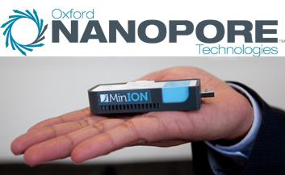
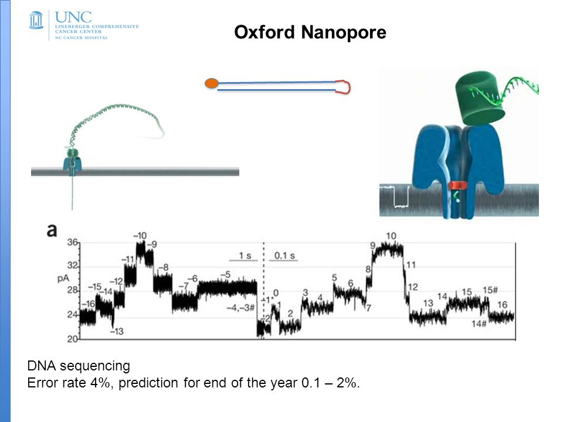
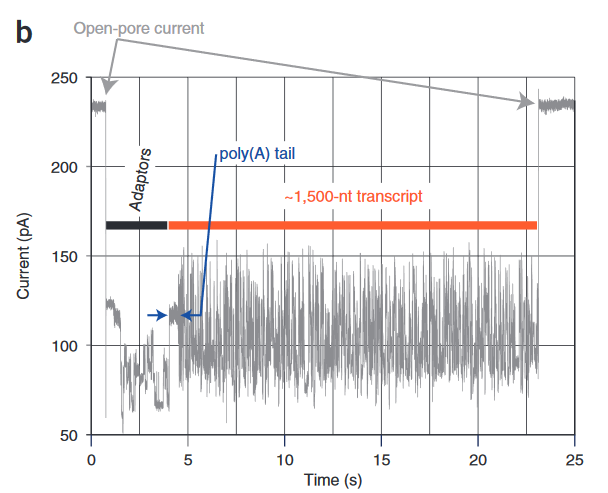
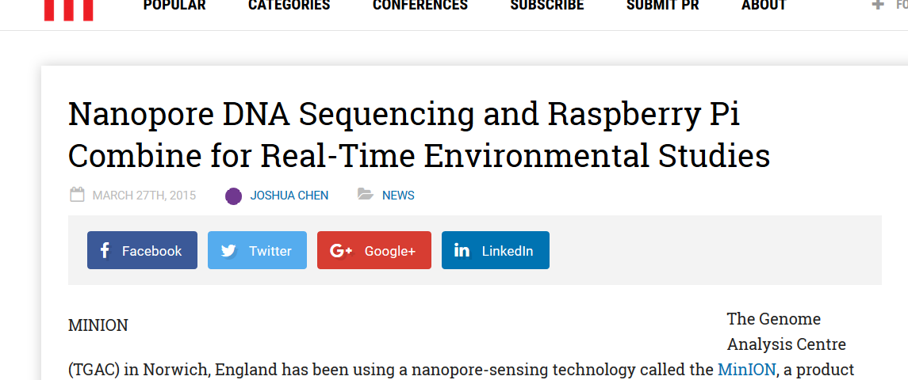
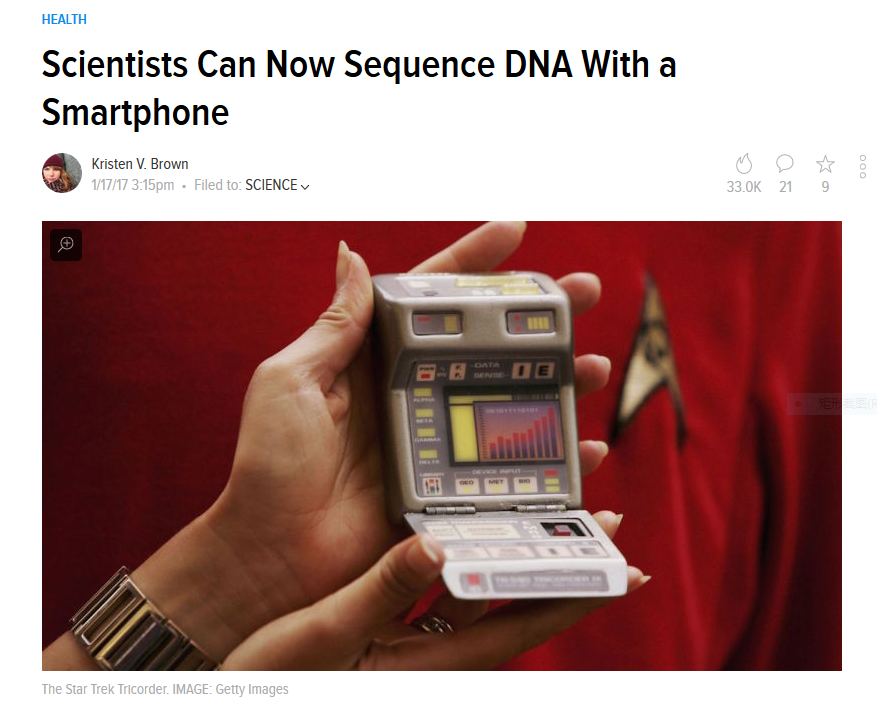
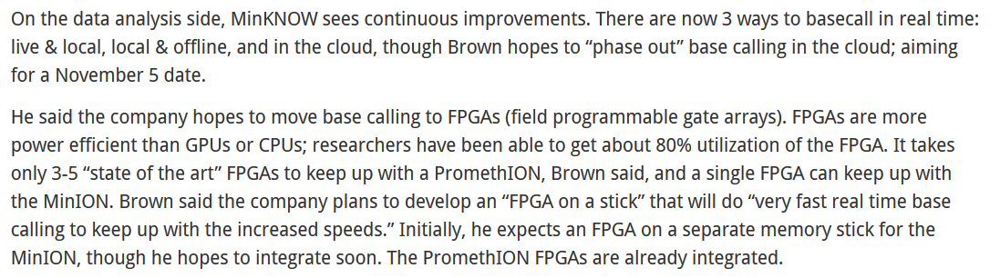
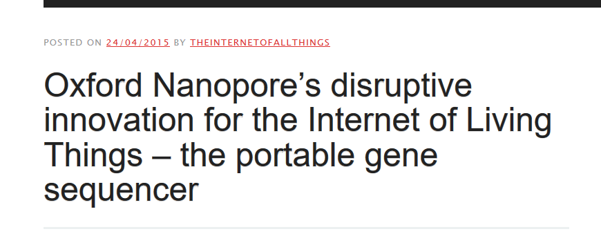

# Oxford Nanopore Sequencing

## A handy usb-like sequencer

## Principle of nanopore sequencing

## Different regions return different signals

## Characteristics of nanopore sequencing technologies

+ Real-time data analysis:data analysis  no fixed run-time
+ Portability and options for fast library prep
+ Scalability
+ Ultra-long read lengths
+ Direct molecular analysis

## Applications of nanopore sequencing technologies

+ Basic genome research
+ Clinical research
+ Microbiome / Environmental research
+ Transcriptome research

# Data Analysis

## Softwares and tools

<table>
<colgroup>
<col width="24%" />
<col width="38%" />
<col width="38%" />
</colgroup>
<thead>
<tr class="header">
<th>Action\\Source</th>
<th>ONT</th>
<th>Community</th>
</tr>
</thead>
<tbody>
<tr class="odd">
<td>QC</td>
<td>Albacore</td>
<td>poRe/Poretools/IONiser</td>
</tr>
<tr class="even">
<td>Alignment</td>
<td>Albacore</td>
<td>NanoOK/GraphMap/marginAlign</td>
</tr>
<tr class="odd">
<td>Building consensus</td>
<td>N/A</td>
<td>Nanopolish</td>
</tr>
<tr class="even">
<td>Error correction</td>
<td>N/A</td>
<td>nanoCORR/nanoraw</td>
</tr>
<tr class="odd">
<td>De novo Assembly</td>
<td>N/A</td>
<td>Canu/Minimap/Smartdenovo</td>
</tr>
<tr class="even">
<td>Metagenomics</td>
<td>WIMP</td>
<td>Centrifuge</td>
</tr>
<tr class="odd">
<td>Base calling</td>
<td>Albacore</td>
<td>deepNano</td>
</tr>
</tbody>
</table>

## Three ways to analyze ONT data

   

+ Live & local (Win-bases Desktop: MinKNOW+Albacore)
+ Local & offline (Win-base Desktop: MinKNOW+Albacore)
+ Cloud (EPI2ME)

# The future of ONT sequencer: real-time data analysis & long read sequencing

## Integration of hardwares and softwares (1/3)

+ With Raspberry Pi 

## Integration of hardwares and softwares (2/3)

+ With SmartPhone

## Integration of hardwares and softwares (3/3)

+ On FPGA (News from [BioIT World](http://www.bio-itworld.com/2016/09/29/oxford-nanopore-announces-new-pores-kits-and-updates-on-projects.aspx))

## The ultimate goal is to be a part of Iot (Internet of thing)

# Thanks for your attention